# 糖尿病智慧健康助理（Diabetes Chatbot RAG）系統操作與臨床展示報告

## 一、專案核心價值與架構定位

本專案為針對糖尿病衛教、急性併發症防護與就診前準備打造之「糖尿病智慧健康助理」，具備以下五大核心防禦與臨床協作能力：

1. **臨床安全閘門（Gate A → B → C → D）**：所有衛教回答嚴格依據 TFDA 官方仿單與國健署指引，杜絕 AI 幻覺與擅自處方。
2. **急性紅旗即刻攔截（Fail-Closed 119 防禦）**：遇胸痛、冒冷汗、急性低血糖等危急訊號，阻斷常規對話並轉介急診。
3. **藥袋處方 QR Code 優先解析（Medication Bag QR-First）**：支援醫院處方藥袋 QR 碼解析，自動萃取藥名並連動帶入看診用藥資料，原始相片記憶體處理後立即銷毀。
4. **看診前 3-Stage 整理室（Pre-visit Intake Room）**：以擬真溫度的衛教師問答整理 8 大臨床欄位，支援自然語言多實體抽取與隱私環境隔離。
5. **醫護端調閱後台（Clinician Portal）**：提供醫師前端相機掃描 QR Code 解碼，具備 15 分鐘時效與單次調閱保護機制。

---

## 二、完整 Demo 流程與螢幕截圖解析（11 項流程步驟截圖說明）

本章節完整記錄由「病患端發起諮詢與整理」、「生成加密 QR Code」到「醫護端相機掃碼與調閱」之 11 項步驟實測畫面。

---

### 步驟 1：急性危急紅旗即時攔截（Fail-Closed 119 防禦）

* **測試情境**：病患身體劇烈不適，在 LINE 輸入急症描述。
* **病患輸入**：`我現在胸口劇痛而且全身冒冷汗`
* **系統行為**：
  * Gate A 意圖辨識模組偵測到「胸痛」與「冒冷汗」等危急字眼。
  * 系統採取 Fail-Closed 安全原則，中斷後續生成流程，避免耽誤就醫。
  * 即刻回傳 119 與急診就醫警示。
* **螢幕截圖**：

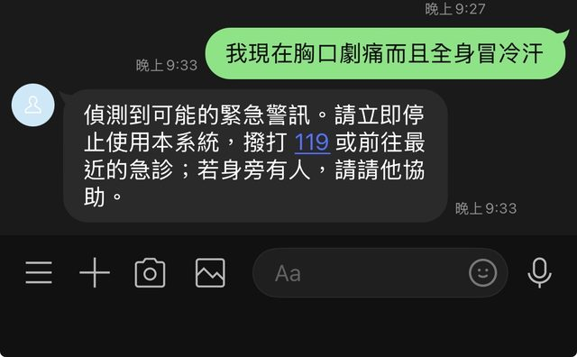

* **展示與報告亮點**：
  * 符合臨床醫療資安與生命安全第一原則。
  * 展現系統絕不在危及生命時刻產生虛假安全感或胡亂提供衛教。

---

### 步驟 2：雙軌 RAG 臨床衛教與安全免責（A→B→C→D 四重閘門）

* **測試情境**：病患詢問日常糖尿病飲食與攝取原則。
* **病患輸入**：`糖尿病可以吃什麼？飲食該怎麼分配？`
* **系統行為**：
  1. 系統於 1 秒內先發送非同步處理通知：「幫你查衛教資料中，查到後立刻傳給你。」，防止 LINE Webhook 超時重試。
  2. 後台啟動雙軌 RAG 檢索（TFDA 仿單 ＋ 國健署糖尿病手冊與飲食指南），本地向量庫以 284 毫秒高速命中官方文獻。
  3. Gate B 執行 15 欄位可靠度審核（判定 PASS）。
  4. Gate C 依據指引受限生成六大類食物、醣類代換原則、定時定量要點，並自動標註免責聲明。
  5. Gate D 進行 8 道確定性安全過濾，杜絕診斷與開處方行為。
* **螢幕截圖**：

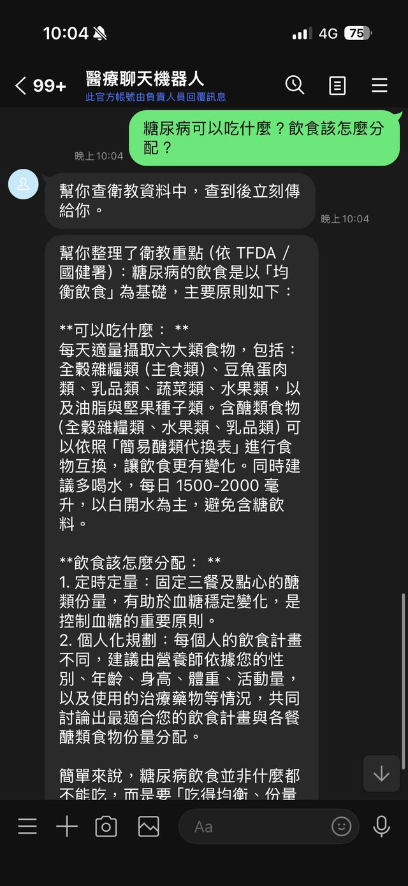

* **展示與報告亮點**：
  * 內容具備醫學權威性與可解釋性，非通用大模型自由臆測。
  * 架構具備高防禦性，兼顧非同步推播的高流暢使用者體驗。

---

### 步驟 3：藥袋處方 QR Code 優先解析（Medication Bag QR-First）

* **測試情境**：病患在 LINE 聊天室直接拍攝並上傳醫院藥袋照片。
* **病患操作**：傳送臺北榮民總醫院藥袋（含處方 QR Code）。
* **系統行為**：
  1. 系統優先呼叫 `MedicationBagOCRService` 解析藥袋右上角之處方 QR Code。
  2. 解析並提取藥品名稱：`TEGRETOL`。
  3. 提供病患用藥衛教諮詢指引，並附帶「我要準備看診」快捷按鈕，提示可將用藥自動帶入就診資料。
  4. 原始照片於記憶體解析完成後立即銷毀，絕不持久化儲存。
* **螢幕截圖**：

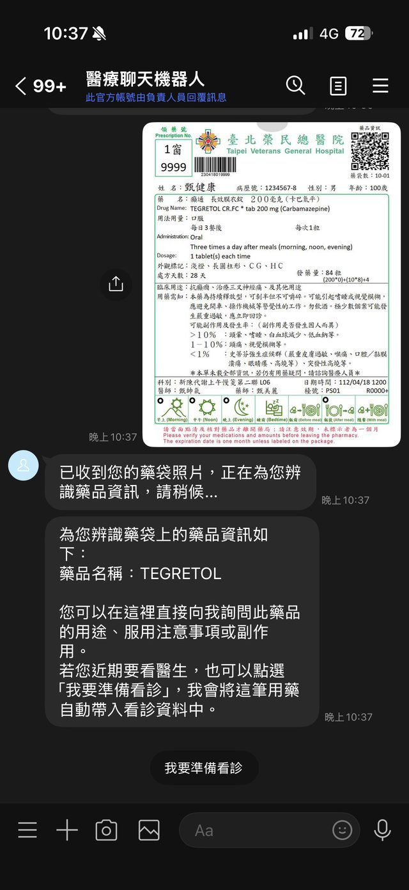

* **展示與報告亮點**：
  * QR Code 優先機制能百分之百避免病患因拍照反光或打字錯別字導致藥名辨識錯誤。
  * 完整貫徹個資保護與醫療影像不落地原則。

---

### 步驟 4：看診前對談室安全跳轉引導

* **測試情境**：病患點擊「我要準備看診」快捷按鈕。
* **系統行為**：
  * 系統在 LINE 聊天室中推送「看診前對談室」Flex 卡片。
  * 清楚說明：LINE 適合日常衛教，而個人的病況、病史與就診資料將轉移至獨立安全的專用網頁對談室整理。
  * 支援進度隨時暫停與斷點續填，確保隱私隔離。
* **螢幕截圖**：

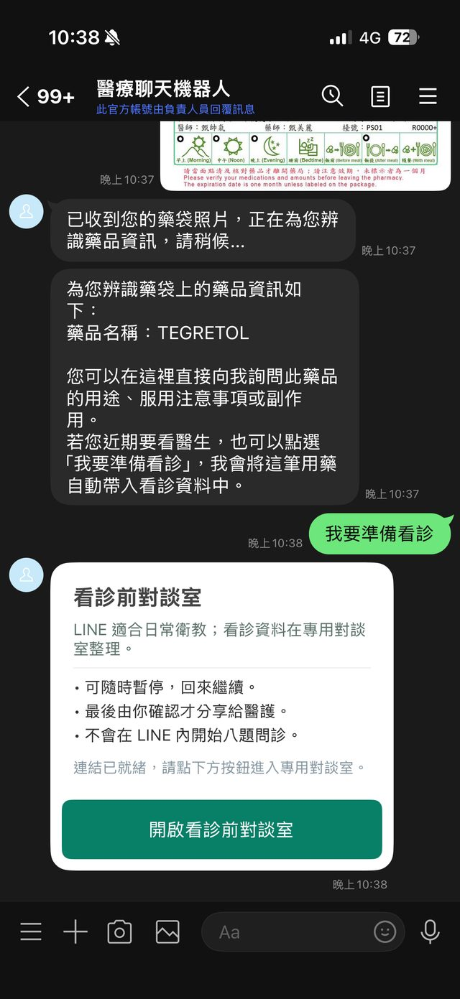

* **展示與報告亮點**：
  * 實現「日常通訊通道」與「敏感醫療病史通道」之安全分流隔離。

---

### 步驟 5：看診前 AI 對談室 — 第一階段：用藥與過敏病史

* **測試情境**：病患點擊進入專用對談室網頁。
* **系統行為**：
  * 系統頂端自動顯示「已帶入藥袋：TEGRETOL」，無縫銜接上一階段辨識成果。
  * 虛擬衛教師以自然親切的口吻向病患問候，並展開第一段健康史詢問（過敏史、其他慢性病、家族史）。
* **螢幕截圖**：

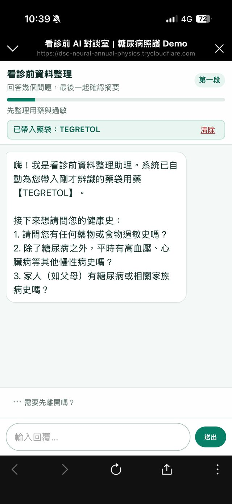

* **展示與報告亮點**：
  * 跨管道（LINE 到 Web）資料狀態連貫，免除病患重複填寫困擾。
  * 頂部進度條清晰呈現目前進度（第一段）。

---

### 步驟 6：看診前 AI 對談室 — 第二階段：主訴症狀與嚴重程度

* **測試情境**：病患以口語化自然語言一次回答多個病史項目。
* **病患輸入**：`我花生過敏 我還有高血壓跟高血脂 我姐姐有糖尿病`
* **系統行為**：
  * 系統自然語言解析器精準萃取三個面向：
    * 過敏史：花生過敏
    * 慢性病史：高血壓、高血脂
    * 家族史：姊姊有糖尿病
  * 給予溫暖的同理心回饋，並順暢推進至第二階段：詢問主要不適症狀、開始時間與 1-10 分嚴重程度。
  * 提供快捷選項（如「3天前口渴頻尿」、「1週前頭暈疲倦」）降低長輩與病患填答負擔。
* **螢幕截圖**：

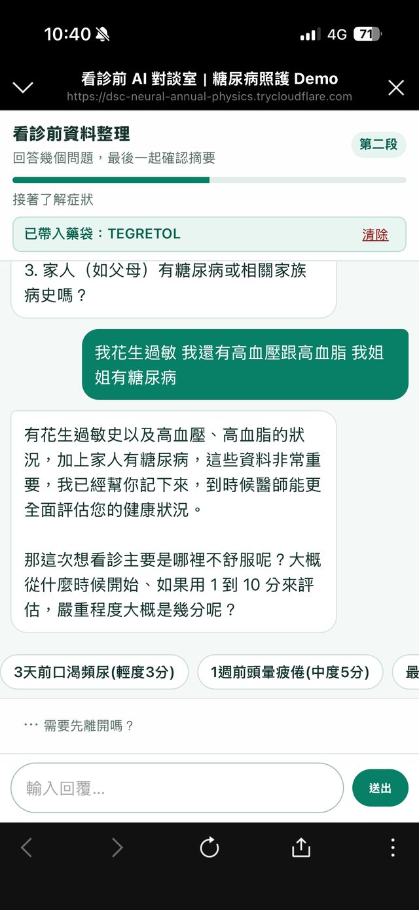

* **展示與報告亮點**：
  * 支援非結構化口語多實體同時辨識，擺脫傳統死板的表單填寫。
  * 具擬真臨床溫度的對談體驗。

---

### 步驟 7：看診前 AI 對談室 — 第三階段：生活影響與就醫提問

* **測試情境**：病患描述主訴症狀開始時間與自評嚴重度。
* **病患輸入**：`一週前開始容易頭暈想睡覺，大約5分中度`
* **系統行為**：
  * 系統同理傾聽，確認記錄症狀（一週前、頭暈想睡、中度 5 分）。
  * 進度條切換至「第三段」，引導病患思考並寫下「這次看診最想請教醫師或討論的問題」。
* **螢幕截圖**：

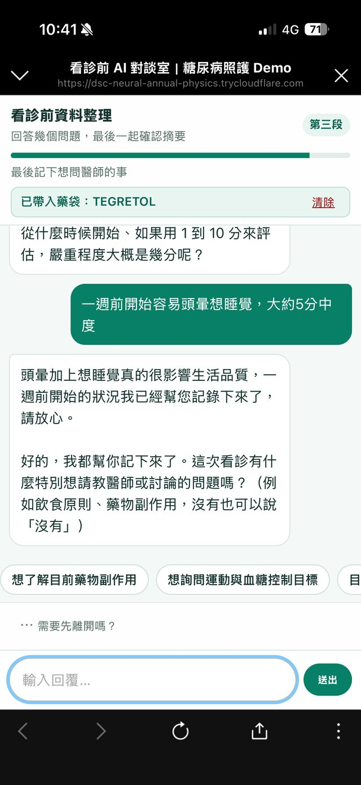

* **展示與報告亮點**：
  * 引導病患於就診前預先釐清問題，改善門診常見的「看診腦袋一片空白」現象，有效提升醫病溝通效率。

---

### 步驟 8：結構化摘要確認（Review & Confirm Snapshot）

* **測試情境**：病患輸入就診問題，系統彙整 8 大欄位並由病患做最終確認。
* **病患輸入**：`早餐如果只喝乳清蛋白會影響糖尿病嗎`
* **系統行為**：
  * 系統將全流程問答精準收斂為「看診前摘要」結構化卡片：
    * **目前用藥**：TEGRETOL
    * **過敏史**：花生
    * **慢性病史**：高血壓、高血脂
    * **家族史**：糖尿病
    * **症狀開始時間**：一週前
    * **主要症狀**：容易頭暈想睡覺
    * **症狀程度**：中度
    * **想問醫師的問題**：早餐如果只喝乳清蛋白會影響糖尿病嗎
  * 提供「確認完成」與「修改資料」按鈕，由病患掌握自身資料授權主導權。
* **螢幕截圖**：

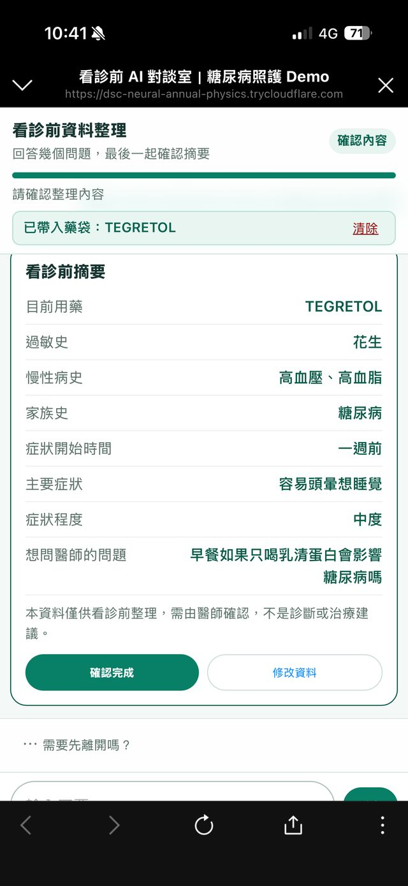

* **展示與報告亮點**：
  * 結構化清晰，利於後續醫師於 10 秒內快速掌握全盤病況。
  * 符合臨床知情確認原則，病患點擊確認後即進入專屬加密分享碼生成流程。

---

### 步驟 9：生成一次性加密分享碼與專屬 QR Code（時效 15 分鐘）

* **測試情境**：病患點選「確認完成」後，系統即時生成具時效保護之就診分享憑證。
* **系統行為與介面呈現**：
  * 頂部進度條達到 100% 滿格，徽章切換為 **「已完成」**，副標籤顯示「看診前資料已整理好 分享碼已產生」。
  * 產出高安全規格之 **一次性分享碼**（例如：`WIZ_46tYKoUmJS2fHBkmZAzH57Hd4U5-7xl9OB26o20`）。
  * 同步生成清晰的高對比 **專屬 QR Code 圖片**，便於在診間直接讓醫護人員掃描。
  * 嚴格標明 **有效期限（精確至秒，15 分鐘時效倒數）**。
  * 註明「此碼只顯示在目前頁面」，充分貫徹敏感醫療資料不隨意落地與最小授權原則。
* **螢幕截圖**：

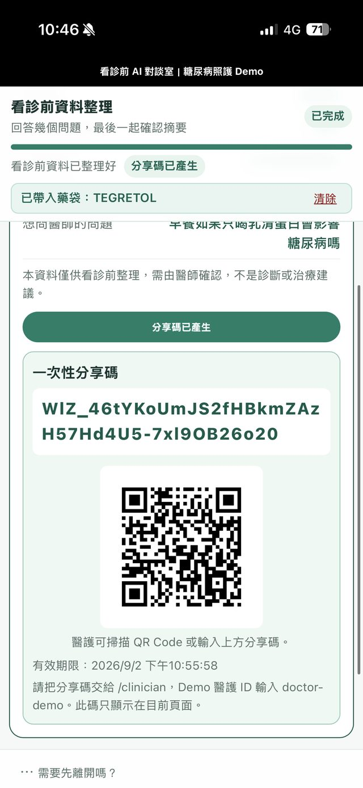

* **展示與報告亮點**：
  * 實現病患端到醫護端的安全橋樑，將 8 大臨床欄位以加密 Token 包裝，保護病患隱私。
  * 病患只需在診間出示手機螢幕供醫師掃描，完全免去紙本與手動鍵入。

---

### 步驟 10：醫護端調閱入口與相機掃描 QR Code（Clinician Portal）

* **測試情境**：門診醫師開啟醫護專屬唯讀調閱後台。
* **操作網址**：`https://dsc-neural-annual-physics.trycloudflare.com/clinician`
* **系統介面亮點**：
  * 頂端註記臨床「安全界線」聲明，提醒不可取代正式病史詢問與處方判斷。
  * 狀態徽章顯示「Demo 已啟用」，醫護身分自動帶入授權白名單 `doctor-demo`。
  * 醒目提供 **「開啟相機掃描 QR Code」** 藍色功能按鈕，支援使用手機相機或筆電鏡頭對準病患 QR Code 進行即時相機辨識解碼。
  * 同步保留手動輸入「病患一次性分享碼」與「病患 session_id」之雙軌容錯機制。
* **螢幕截圖**：

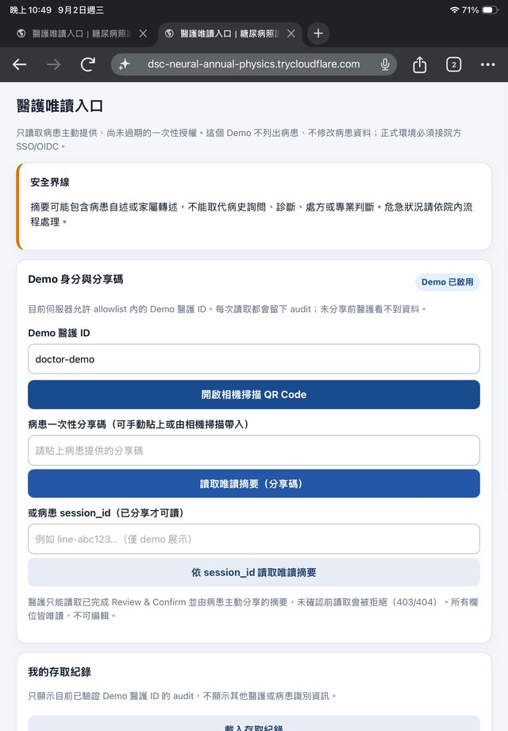

* **展示與報告亮點**：
  * 介面乾淨專業，兼顧門診實體掃描與遠距調閱需求。
  * 嚴格限制僅能讀取病患主動授權之摘要，無列舉或修改其他病患資料之危險權限。

---

### 步驟 11：醫護端調閱與單次存取驗證（Gate D: PASS 臨床摘要）

* **測試情境**：醫師掃描病患手機上的 QR Code 或貼上分享碼後，成功調閱資料。
* **系統反應與渲染呈現**：
  * 右上角醒目顯示 **`D gate：PASS`** 綠色徽章，代表該筆資料已通過 Gate D 輸出安全過濾。
  * 分享碼狀態標明：**`已使用一次（不可重放）`**，精準落實「單次調閱（使用後失效）」資安規範，防止二次調閱洩漏。
  * 清楚渲染 **8 大資料區塊（去重後）**，並標註來源「病患已提供」：
    * **目前用藥**：TEGRETOL
    * **過敏史**：花生
    * **慢性病史**：高血壓、高血脂
    * **家族史**：糖尿病
    * **症狀開始時間**：一週前
    * **主要症狀**：容易頭暈想睡覺
    * **症狀程度**：中度
    * **想問醫師的問題**：早餐如果只喝乳清蛋白會影響糖尿病嗎
  * 彙整 **時間軸（按發生時間）**：`【一週前】容易頭暈想睡覺（程度：中度）（用藥：TEGRETOL）`。
  * 系統安全分流評估（`NO_DEFINED_SIGNAL`）與免責提示。
* **螢幕截圖**：

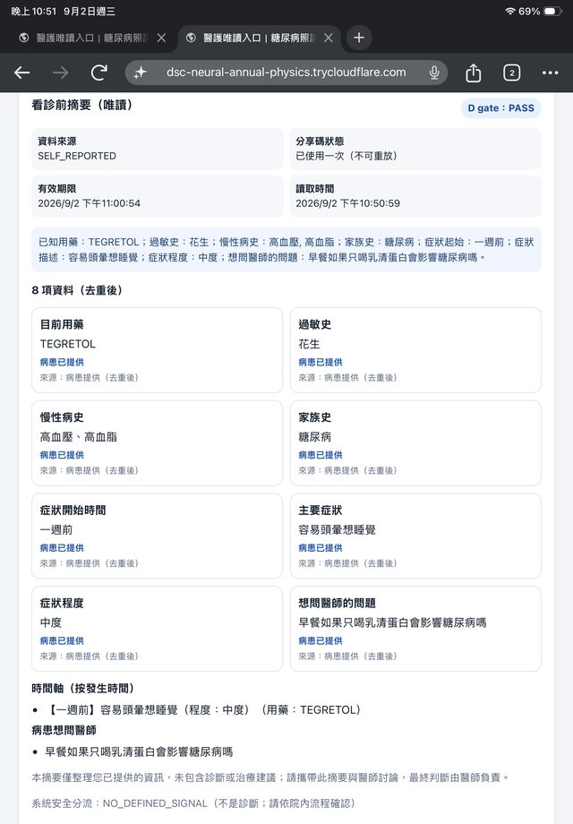

* **展示與報告亮點**：
  * 醫師能在 10 秒內完全掌握病患主訴、用藥歷程與就醫目的，大幅節省問診時間。
  * 單次調閱與 Audit Log 紀錄，防止重複調閱並保留存取軌跡。
