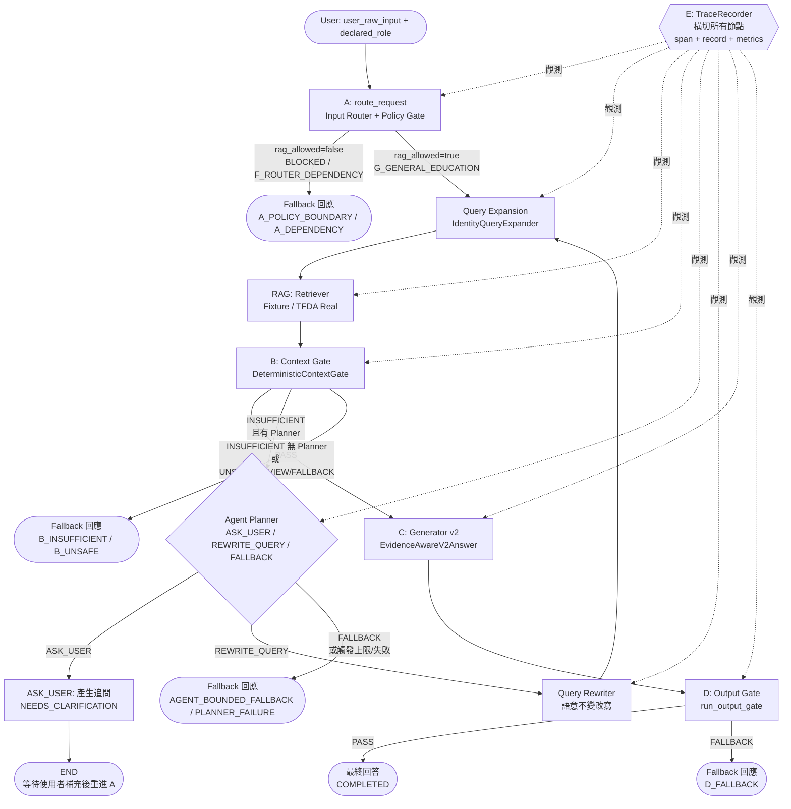

# tfda_context_gate 程式碼全景圖

> **給新開發者的 10 分鐘地圖** — 讀完本頁，你會知道專案在做什麼、程式碼怎麼組織、從哪裡開始讀、怎麼跑測試與 Demo、以及哪些紅線不能踩。

- **專案根目錄**：`tfda_context_gate/`
- **最後核對**：2026-08-21（以 `README.md` / `CURRENT_ARCHITECTURE.md` / `ARCHITECTURE_AUDIT.md` 與 `workflow/graph.py`、`workflow/runner.py` 為準）
- **延伸閱讀**：[`README.md`](../../tfda_context_gate/README.md) · [`CURRENT_ARCHITECTURE.md`](../../archive/docs/CURRENT_ARCHITECTURE.md) · [`ARCHITECTURE_AUDIT.md`](../../archive/docs/ARCHITECTURE_AUDIT.md) · [`V0_1_提案書.md`](../proposal/v0.1/V0_1_提案書.md) · [`V0_1_交付說明書.md`](../proposal/v0.1/V0_1_交付說明書.md)

---

## 1. 專案定位：這是什麼、不是什麼

**是什麼**：以 TFDA 糖尿病用藥安全語料（129 筆 `data/processed/langchain_documents.json`）為基礎的 **LLM / RAG / Agentic Workflow Demo 與研究基線（MVP）**。用來驗證「證據可追溯的衛教回答」與 A/B/C/D 安全邊界 + E 可觀測性的工程可行性。

**不是什麼**：

- ❌ 不是自主臨床決策系統
- ❌ 不是已上線的生產級醫療系統
- ❌ 不做身分驗證、工具授權、PHI 個資治理
- ❌ 急性/急症閾值未經正式臨床核可，僅為 Demo 規則

> 一句話：**「能跑、能測、能追溯，但不能直接拿去看病。」**

---

## 2. 架構總覽：A / B / C / D / E

### 2.1 一句話職責

| 代號 | 名稱 | 一句話職責 |
|------|------|------------|
| **A** | Input Router + Policy Gate | 驗證輸入、擋 prompt injection、抽信號、做確定性政策分流；**唯一決定 `rag_allowed`** |
| **Query Expansion** | 查詢擴寫 | v0.1 為確定性 `Identity` 擴寫（保留原句、只發一條檢索句）；介面可插拔 |
| **RAG** | 檢索 | 從 TFDA 語料檢索 `CanonicalEvidence[]`，保留 `evidence_id` / 來源 / 日期 |
| **B** | Context Gate | 判斷檢索結果是否**足夠且安全**可用；只有 `PASS` 才放行，`INSUFFICIENT` 才可能進 Agent |
| **Agent** | 有界復原分支 | 僅在 B=`INSUFFICIENT` 時由 Planner 選 `ASK_USER` / `REWRITE_QUERY` / `FALLBACK`；不改政策、不批證據、不繞 D |
| **C** | Evidence-aware Generator | 只能引用 **B 已核准**的 `evidence_id` 產生 `ANSWER` / `PARTIAL` / `INSUFFICIENT` |
| **D** | Mandatory Output Gate | 最終強制閘門，只回 `PASS` 或 `FALLBACK`；任何 C 候選都必須過 D |
| **E** | Observability | 橫切觀測層，記錄 A/QE/RAG/B/Agent/C/D 的 `TraceEvent` 與 `EvaluationRecord`；**不改答案、不改政策** |

### 2.2 流程圖（Mermaid）



### 2.3 文字版確定性基線（無 Agent 時）

```text
User
  -> A: Input Router + Policy Gate          (a_router/router.py:route_request)
  -> Query Expansion                        (query_expansion/expander.py:IdentityQueryExpander)
  -> RAG retrieval                          (rag/retriever.py 或 rag/tfda_retriever.py)
  -> B: Context Gate                        (b_context_gate/gate.py:DeterministicContextGate)
  -> C: Evidence-aware Generator v2         (c_generator/workflow_adapter.py)
  -> D: Mandatory Output Gate               (d_output_gate/gate.py:run_output_gate)
  -> Answer 或 Fallback

E 橫切：每個階段都包在 TraceRecorder.span() 內，記錄 STARTED/COMPLETED/BLOCKED/INSUFFICIENT/FALLBACK/ERROR
```

有界 Agent 分支僅在 `B == INSUFFICIENT` 且注入 `AgentPlanner` 時觸發，詳見 `workflow/graph.py:build_workflow_graph` 的 `b_route` 與 `agent_route` 條件邊。

---

## 3. 目錄職責對照表

| 頂層目錄/檔案 | 職責（一句話） | 關鍵檔案 |
|---------------|---------------|----------|
| `a_router/` | **A 正式模組**：輸入驗證、prompt guard、信號抽取、確定性政策 | `schemas.py`、`labels.py`、`guard.py`、`rules.py`、`policy.py`、`router.py` |
| `query_expansion/` | **查詢擴寫**：v0.1 確定性 Identity 實作，保留 `original_query` | `schemas.py`、`expander.py`、`adapters.py` |
| `rag/` | **檢索邊界**：`RAGResult`、`CanonicalEvidence` 正規化、Fixture/Real 雙路徑 | `schemas.py`、`retriever.py`、`tfda_retriever.py`、`demo.py` |
| `b_context_gate/` | **B 正式邊界**：`CanonicalBInput`/`CanonicalBResult` 與 legacy 適配 | `schemas.py`、`gate.py`、`adapters.py` |
| `c_generator/` | **C 生成**：v2 為 workflow 正式契約，v1 僅保留作 legacy/實驗（`generator.py`/`v2_run_experiment.py`/`b_to_c_interface.py` 已搬至 `experiments/c_generator/`，`workflow_adapter.py`/`prompts.py` 為 re-export 舊路徑仍可用但新路徑為主） | `schemas.py`、`workflow_adapter.py`、`system_prompts.py`、`user_prompts.py` |
| `d_output_gate/` | **D 強制閘門**：schema/證據/政策/紅線/語意驗證，只回 PASS/FALLBACK | `schemas.py`、`gate.py`、`adapters.py`、`verifier.py`、`policy.py` |
| `e_observability/` | **E 觀測層**：`TraceEvent`/`EvaluationRecord`、span、JSONL sink、脫敏 | `schemas.py`、`tracer.py`、`sinks.py`、`metrics.py`、`privacy.py` |
| `agent/` | **Agent 執行期**：Planner、Rewriter、Limits、OpenRouter/Ollama 適配 | `planner.py`、`rewriter.py`、`config.py`、`openrouter.py`、`ollama.py` |
| `workflow/` | **編排層**：LangGraph `StateGraph` 與 `run_workflow()` 唯一確定性入口 | `graph.py`、`runner.py`、`adapters.py`、`fallbacks.py`、`schemas.py` |
| `tests/` | **契約測試**：A/D/E/Workflow/Agent/Real TFDA 邊界測試 | `test_a_router.py`、`test_d_output_gate.py`、`test_e_observability.py` 等 |
| `data/` | **語料**：`raw/` 原始、`processed/langchain_documents.json` 129 筆處理後語料 | `data/processed/langchain_documents.json` |
| `00_*.py` ~ `05_*.py` | **研究期腳本**：Phase 1–5 檢索/rerank/judge/hybrid 實驗，刻意不搬移 | `01_build_documents.py` ~ `05_hybrid.py` |
| `run_config.py` / `rate_limiter.py` | **實驗共用**：執行期目錄/dotenv 與 API 限流工具 | `run_config.py`、`rate_limiter.py` |
| `prompts/` | **提示詞**：C 生成與 judge 相關模板 | `prompts/` |
| `examples/` / `experiments/` / `fixtures/` | **索引層**：可跑範例、phase 腳本索引、fixture 溯源索引（已搬至 `experiments/c_generator/`） | `examples/`、`experiments/`、`fixtures/` |
| `results/` / `runs/` / `reports/` | **產物**：phase 結果、隔離執行紀錄、研究報告 | `results/`、`runs/`、`reports/` |
| `deliverables/` | **封存**：歷史交付物與 staged 複本（待清理） | `deliverables/` |
| `./` | **文件**：本全景圖與後續模組文件 | `00_overview.md`（本檔） |

> 為何 `00_*.py` 還在根目錄？`CURRENT_ARCHITECTURE.md` 已說明：它們使用 `from run_config import ...` 這類 script-local import，搬移會破壞可重現性，故刻意保留。

---

## 4. 進入點（Entry Points）一覽

| 區域 | 函式 / 指令 | 來源 |
|------|-------------|------|
| **A** | `route_request()` / `run_a()`（alias） | `a_router/router.py` |
| **A Demo** | `python3 -m tfda_context_gate.a_router.demo --guard regex` | `a_router/demo.py` |
| **Query Expansion** | `IdentityQueryExpander.expand()` | `query_expansion/expander.py` |
| **RAG Fixture** | `FixtureRetriever.retrieve()` | `rag/retriever.py` |
| **RAG Real** | `TFDADrugSafetyRetriever.retrieve()` | `rag/tfda_retriever.py` |
| **RAG Demo** | `python3 -m tfda_context_gate.rag.demo --all --top-k 5` | `rag/demo.py` |
| **B** | `DeterministicContextGate.evaluate()` | `b_context_gate/gate.py` |
| **C v2 正式** | `CWorkflowInput` + `LangChainCV2Generator` / `DeterministicFixtureCGenerator` | `c_generator/workflow_adapter.py` |
| **C 實驗** | `run_generators()` / `invoke_one()` / `v2_run_experiment.run_generator()` | `experiments/c_generator/generator.py`、`experiments/c_generator/v2_run_experiment.py` |
| **D** | `run_output_gate(payload, verifier=..., policy_rules=..., fallback_response=...)` | `d_output_gate/gate.py` |
| **E** | `TraceRecorder` + `JsonlTraceSink` + `span()` / `record()` / `record_failure()` | `e_observability/tracer.py`、`e_observability/sinks.py` |
| **E Demo** | `python3 -m tfda_context_gate.e_observability.demo --log-path /tmp/tfda-e.jsonl` | `e_observability/demo.py` |
| **Workflow** | `run_workflow()`（**唯一 A–E 確定性基線入口**） | `workflow/runner.py` |
| **Workflow Graph** | `build_workflow_graph()`（LangGraph 編譯） | `workflow/graph.py` |
| **Workflow Demo** | `python3 -m tfda_context_gate.workflow.demo --log-path /tmp/tfda-a-e-workflow.jsonl` | `workflow/demo.py` |
| **Agent Demo** | `python3 -m tfda_context_gate.agent.demo --planner fixture --retriever fixture --show-trace` | `agent/demo.py` |
| **Agent LLM** | `python3 -m tfda_context_gate.agent.demo --planner llm --provider openrouter --retriever fixture` | `agent/openrouter.py` |
| **Agent Ollama** | `python3 -m tfda_context_gate.agent.demo --planner llm --provider ollama --retriever fixture` | `agent/ollama.py` |

---

## 5. 資料契約摘要

> 完整欄位見 `CURRENT_ARCHITECTURE.md`「Current Contracts」；此處為速查表。

| 邊界 | 輸入 Schema | 輸出 Schema | 關鍵欄位提醒 |
|------|-------------|-------------|--------------|
| **A** | `a_router.schemas.RequestContext` | `a_router.schemas.AResult` | `request_id`、`user_raw_input`、`declared_role`、`language` → `router_status`（唯一）、`reason_codes`、`rag_allowed`（僅 `G_GENERAL_EDUCATION` 為 true） |
| **Query Expansion** | `query_expansion.schemas.QueryExpansionInput` | `query_expansion.schemas.QueryExpansionResult` | `original_query` 不變、`retrieval_queries[]` 恰一條、`strategy` |
| **RAG** | `QueryExpansionResult` | `rag.schemas.RAGResult` | `original_query`、`retrieval_queries[]`、`evidence[]: CanonicalEvidence[]`、`retrieval_latency_ms` |
| **B** | `b_context_gate.schemas.CanonicalBInput` | `b_context_gate.schemas.CanonicalBResult` | `decision: PASS/INSUFFICIENT/UNSAFE/REVIEW/FALLBACK`、`approved_evidence_ids[]`、`evidence[]`、`reason_codes[]`、`relevance/sufficiency/conflict/safety` |
| **C v2** | `c_generator.workflow_adapter.CWorkflowInput` | `c_generator.schemas.EvidenceAwareV2Answer` | `decision: ANSWER/PARTIAL/INSUFFICIENT`、`answer`、`supported_claims[]`（每條含 `evidence_ids[]`）、`unsupported_requests[]`、`limitations[]` |
| **D** | `d_output_gate.schemas.OutputGateRequest` | `d_output_gate.schemas.OutputGateResult` | 只回 `PASS`/`FALLBACK`，含 `failure_type`、`reason_codes`、`invalid_evidence_ids`、`final_response` |
| **E Trace** | — | `e_observability.schemas.TraceEvent` | `request_id`、`trace_id`、`component`、`operation`、`status`、`latency`、RAG 溯源、Agent 欄位（`agent_action`/`step_count`/`termination_reason` 等） |
| **E Evaluation** | — | `e_observability.schemas.EvaluationRecord` | 離線標註用：`actual_decision`、`outcome`、`failure_type` |
| **Workflow** | `RequestContext` 或 `dict` | `workflow.schemas.WorkflowResult` | `status`、`final_response`、`fallback_reason`、各階段 dump、`trace` 快照、`agent_action`/`termination_reason` |

**命名適配**：`b_context_gate/adapters.py`、`rag/schemas.py`、`d_output_gate/adapters.py` 會正規化 `document_id`→`evidence_id`、`contexts`→`evidence`、`b_decision`→`decision`、`claims`→`supported_claims` 等歷史差異。正式流程只認 `evidence_id`。

---

## 6. 閱讀順序（10 分鐘路徑）

照此順序讀，剛好繞一圈：

```text
1. 本檔 (00_overview.md)          2 分鐘 — 建立地圖
2. README.md § Project Overview + Architecture    2 分鐘 — 對照 A→D 文字流程
3. CURRENT_ARCHITECTURE.md § Current Modules     2 分鐘 — 看各模組「重要檔案」清單
4. workflow/runner.py (run_workflow)             1 分鐘 — 看唯一入口如何組裝依賴
5. workflow/graph.py (build_workflow_graph)      2 分鐘 — 看 LangGraph 節點與條件邊
6. a_router/router.py + d_output_gate/gate.py    1 分鐘 — 看頭尾兩道閘門的進出
```

**想深入單模組**：

- 關心政策 → `a_router/policy.py` + `a_router/labels.py` + `a_router/guard.py`
- 關心檢索 → `rag/tfda_retriever.py` + `rag/tfda_smoke_cases.py` + `b_context_gate/gate.py`
- 關心生成 → `c_generator/workflow_adapter.py` + `c_generator/schemas.py`
- 關心觀測 → `e_observability/tracer.py` + `e_observability/schemas.py` + `e_observability/trajectory.py`
- 關心 Agent → `agent/planner.py` + `agent/rewriter.py` + `agent/config.py` + `workflow/graph.py:planner_node`

---

## 7. 如何跑測試與 Demo

### 7.1 測試

```bash
# 在 repo 根目錄（langchain_1.2/）執行
python3 -m pytest -q

# 只跑單類
python3 -m pytest -q tfda_context_gate/tests/test_a_router.py
python3 -m pytest -q tfda_context_gate/tests/test_d_output_gate.py
python3 -m pytest -q tfda_context_gate/tests/test_e_observability.py
python3 -m pytest -q tfda_context_gate/tests/test_workflow_integration.py
python3 -m pytest -q tfda_context_gate/tests/test_agent_demo_cases.py tfda_context_gate/tests/test_agent_runtime.py
python3 -m pytest -q tfda_context_gate/tests/test_tfda_retriever.py
```

> 最後驗證（見 `README.md` / `CURRENT_ARCHITECTURE.md`）：全量約 **68 passed, 10 skipped**（7 個 embedding smoke case 在無 HF 環境下 skip）。若用 `.venv` 跑 real vector smoke，7 個 TFDA 檢索案例皆命中預期 `evidence_id`。

### 7.2 Demo

```bash
# E 觀測 Demo（寫 JSONL）
python3 -m tfda_context_gate.e_observability.demo --log-path /tmp/tfda-e-demo.jsonl

# A–E 端到端基線（預設：real TFDA RAG + 確定性 B/C fixture + D）
python3 -m tfda_context_gate.workflow.demo --log-path /tmp/tfda-a-e-workflow.jsonl

# 完全離線契約路徑
python3 -m tfda_context_gate.workflow.demo --retriever fixture --log-path /tmp/tfda-offline.jsonl

# Real TFDA 語料 + 角色案例（P1/P2/H1/H2/H3/C1/C2 為檢索案例，P3 為 A 攔截，C3 為 ASK_USER 候選）
python3 -m tfda_context_gate.rag.demo --all --top-k 5
python3 -m tfda_context_gate.workflow.demo --retriever real --case P1 --log-path /tmp/tfda-real-workflow.jsonl

# Agent v0.1 離線 Demo（含軌跡）
python3 -m tfda_context_gate.agent.demo --planner fixture --retriever fixture --show-trace

# Agent + 真實 Planner（OpenRouter 預設 deepseek/deepseek-v4-flash-0731）
python3 -m tfda_context_gate.agent.demo --planner llm --provider openrouter --retriever fixture

# Agent + 本地 Ollama
python3 -m tfda_context_gate.agent.demo --planner llm --provider ollama --retriever fixture

# A 單點 Demo
python3 -m tfda_context_gate.a_router.demo --guard regex
```

> Live RAG/C 實驗需先 `pip install -r tfda_context_gate/requirements.txt` 並配置模型/API 金鑰；**金鑰不可寫入原始碼、query、fixture 或 log**，請用環境變數或本地未追蹤的 `.env`。

---

## 8. 硬性邊界（Hard Boundaries）Checklist

改程式碼前逐條勾選，違反任一條即視為破壞安全契約：

- [ ] **A 是政策權威**：Agent / C / D 的 adapter 都不能覆寫 A 的 `router_status` / `rag_allowed`
- [ ] **prompt guard 失效要 fail-closed**：`F_ROUTER_DEPENDENCY` 且 `rag_allowed=False`
- [ ] **只有 `G_GENERAL_EDUCATION` 能進一般 RAG**：其他 route 一律不檢索
- [ ] **`declared_role` 不授權**：`PATIENT` / `CAREGIVER` / `HEALTHCARE_PROFESSIONAL` 僅影響呈現，不提升資料/工具/模型權限
- [ ] **B 批准才算數**：檢索到的 `evidence` ≠ 已批准；C 只能引用 `approved_evidence_ids`
- [ ] **C 每條 claim 必帶 `evidence_ids`**，且必須是 B 已批准的子集
- [ ] **D 為強制閘門**：任何 C 候選未經 `run_output_gate()` 不得直接回傳；Agent 亦不可繞過 D
- [ ] **E 只觀測**：不可改 prompt / policy / model / deployment / 醫療答案；sink 失敗要隔離，不影響主流程
- [ ] **Agent 有界**：`ASK_USER` / `REWRITE_QUERY` / `FALLBACK` 三選一，受 `AGENT_LIMITS`（`max_agent_steps` / `max_rewrites` / `max_clarifications`）約束；`REWRITE_QUERY` 必須語意不變（`validate_meaning_preserving_rewrite`）
- [ ] **B 非 PASS 的基線行為**：無 Planner 時直接 `FALLBACK`；有 Planner 時僅 `INSUFFICIENT` 進 Agent，其他（`UNSAFE`/`REVIEW`/`FALLBACK`）直接結束
- [ ] **證據 ID 唯一真相**：正式流程只認 `CanonicalEvidence.evidence_id`，legacy `document_id`/`chunk_id` 僅在 adapter 轉換

---

## 9. Mock / Fixture vs Real 元件區分

| 類型 | 元件 | 用途 | 是否可用於生產 |
|------|------|------|---------------|
| **Mock / Fixture** | `RuleBasedPromptInjectionGuard` | 離線確定性 guard / fallback | ✅ 測試可用，❌ 非臨床 guard |
| **Mock / Fixture** | `RuleBasedSignalExtractor` | 確定性語意信號抽取 | ✅ Demo，❌ 非臨床 triage |
| **Mock / Fixture** | `FixtureRetriever` | 固定回傳的假檢索 | ✅ 契約測試，❌ 非真實語料 |
| **Mock / Fixture** | `DeterministicContextGate`（含 `all_retrieved` 模式） | 離線 B 閘門；`all_retrieved` 僅供 real corpus demo 標示用 | ✅ 測試/Demo，❌ 非臨床 adjudicator |
| **Mock / Fixture** | `DeterministicFixtureCGenerator` | 離線 C v2 假生成 | ✅ E2E 契約測試，❌ 非生產生成器 |
| **Mock / Fixture** | `HeuristicSemanticVerifier` | D 的 demo 語意驗證器 | ✅ 測試邊界，❌ 非醫療驗證器 |
| **Mock / Fixture** | `JsonlTraceSink` | E 的 demo 落地 | ✅ Demo，生產需補 retention/加密/存取控制/PHI 策略 |
| **Real / Adapter** | `Qwen3GuardPromptInjectionGuard` | 懶加載 `Qwen/Qwen3Guard-Gen-0.6B` 的可選 guard | ⚠️ 需中文醫療 benchmark，非政策權威 |
| **Real** | `TFDADrugSafetyRetriever` | 載入 129 筆 TFDA 語料 + `intfloat/multilingual-e5-small` + `InMemoryVectorStore` 的真實檢索 | ✅ Real corpus 路徑（`--retriever real`） |
| **Real / Adapter** | `LangChainCV2Generator` | 注入外部 structured-output chain 的真實 C v2 適配 | ✅ 需外部注入，runner 不隱式建模 |
| **Real** | `ChatOpenRouter` (`deepseek/deepseek-v4-flash-0731`) / Ollama | Agent Planner 的真實 LLM 適配 | ✅ 需憑證/本地模型 |
| **Experiment** | `04_llm_judge.py` / `05_hybrid.py` / `03_reranker.py` | 實驗期 judge/rerank/hybrid | ❌ 非已核可的 B/C 元件 |

> 判斷原則：`CURRENT_ARCHITECTURE.md` § Mock, Demo and Non-production Components 為準；檔名含 `Fixture` / `Deterministic` / `Heuristic` / `Demo` 者，預設視為非生產元件。

---

## 10. 已知限制（Known Limitations）

- 急性/急症閾值未經臨床核可
- D 的語意驗證器為 demo heuristic，待獨立評估
- Qwen3Guard 需中文醫療領域 benchmark
- `run_workflow()` 預設走 fixture 以保測試速度；`workflow.demo --retriever real` 雖用真實語料，但 B/C 仍為確定性 demo 元件
- Phase 腳本尚未接入 `workflow.runner`
- C v1 僅作 legacy/實驗保留，不參與正式流程
- E JSONL 為 demo sink，生產需補 retention / 存取控制 / 加密 / PHI 脫敏策略
- `declared_role` 非身分驗證
- Live 模型/API 需外部依賴與憑證
- 本目錄目前非 git repo，無歷史 diff 可查

---

## 11. 常見問題（FAQ）

**Q: 我改了 A 的政策，會影響什麼？**
A 會改變 `rag_allowed` 與 `router_status`，進而決定是否進 RAG。務必同步檢查 `d_output_gate/policy.py` 的快照校驗與 `tests/test_a_router.py`。

**Q: 為什麼 B 有時直接 FALLBACK，不進 Agent？**
只有 `INSUFFICIENT` + 有注入 `AgentPlanner` 才進 Agent；`UNSAFE`/`REVIEW`/`FALLBACK` 屬不可復原，直接結束（見 `workflow/graph.py:b_route`）。

**Q: C 可以自己決定引用哪些證據嗎？**
不行。C 只能引用 `b_result.approved_evidence_ids` 的子集，D 會校驗 `invalid_evidence_ids`。

**Q: E 的 trace 可以拿來做決策嗎？**
不行。E 的 `TraceRecorder` 與 `format_trace_trajectory()` 僅供觀測與 CLI 展示（`--show-trace`），不參與圖執行。

**Q: 哪裡看真實語料長什麼樣？**
`data/processed/langchain_documents.json`（129 筆）與 `REAL_TFDA_DATASET_AUDIT.md`；用 `python3 -m tfda_context_gate.rag.demo --all` 直接看 top-k 命中。

---

## 12. 文件地圖

```text
00_overview.md   ← 本檔（全景圖）
../../tfda_context_gate/README.md                 ← 專案總覽、架構分節、安全邊界、進入點、測試/Demo 指令
../../archive/docs/CURRENT_ARCHITECTURE.md   ← Coding Agent 的 Source of Truth（模組/契約/邊界/Mock 清單）
../../archive/docs/ARCHITECTURE_AUDIT.md     ← 審計證據（執行流、模組盤點、schema 矩陣、測試基線）
../../archive/reports/REAL_TFDA_DATASET_AUDIT.md   ← 129 筆語料稽核
../../archive/reports/REAL_TFDA_SMOKE_REPORT.md    ← 真實向量檢索 smoke 報告
../../archive/docs/AGENT_V0_1_CASE_DESIGN.md    ← Agent 三案例設計
../proposal/v0.1/V0_1_提案書.md / ../proposal/v0.1/V0_1_交付說明書.md  ← v0.1 立項與交付說明
```

> 維護約定：改動 A/B/C/D/E/Workflow 任一邊界時，請同步更新 `CURRENT_ARCHITECTURE.md`，並在 `ARCHITECTURE_AUDIT.md` 留下驗證紀錄；本全景圖僅做導覽，不替代兩份 Source of Truth。
